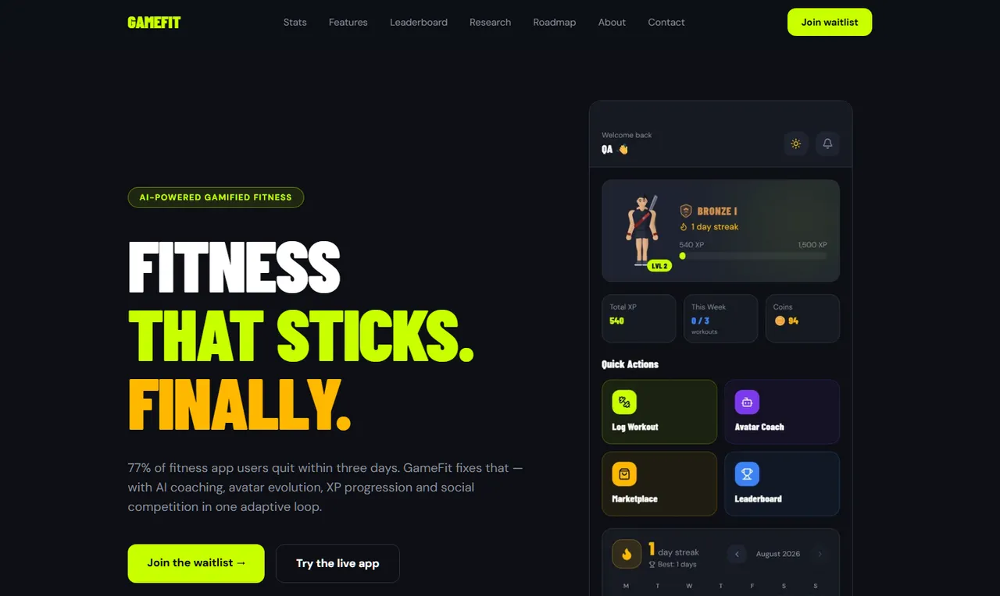
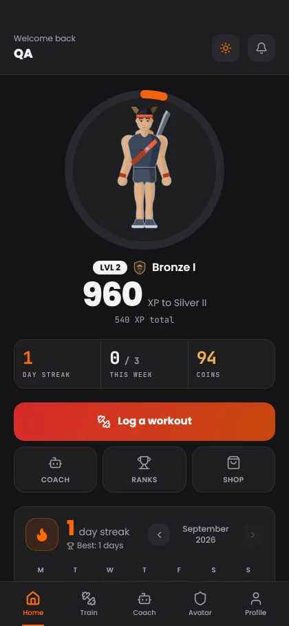
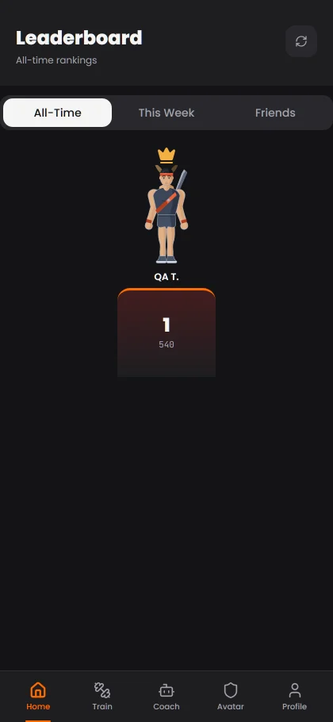
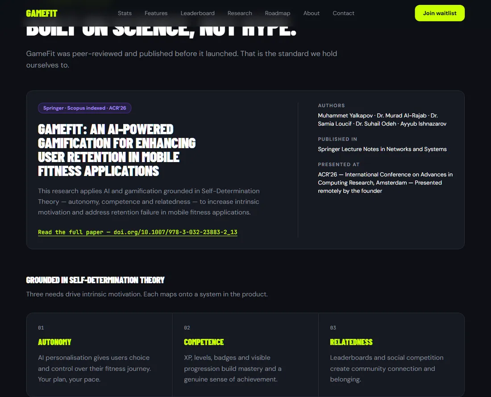
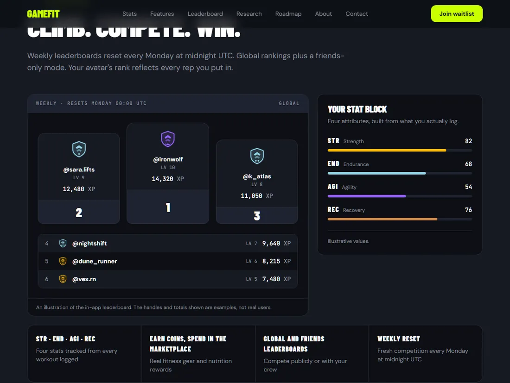

<div align="center">

# GameFit

### Fitness that sticks. Finally.

Turning workouts into an RPG — AI coaching, avatar evolution, XP progression
and social competition in one adaptive loop, grounded in peer-reviewed
behavioural science.

[**Visit the site**](https://gamefit-web.vercel.app) &nbsp;·&nbsp;
[**Try the app**](https://gamefit-app.vercel.app) &nbsp;·&nbsp;
[**Read the research**](https://doi.org/10.1007/978-3-032-23883-2_13)


</div>



---

## The problem

**77% of people who install a fitness app stop using it within three days.**
Not because they lack discipline — because nothing brings them back. No
progression, no feedback that adapts, no reason to open it tomorrow.

GameFit treats that as a motivation design problem rather than a willpower
problem, and builds the answer on Self-Determination Theory: autonomy,
competence, relatedness.

| | |
|---|---|
| **AI coaching** | Personalised plans, nutrition guidance and 24/7 feedback, powered by Anthropic Claude Haiku 4.5. Every call runs server-side; the model never sees data from the browser. |
| **Deep gamification** | XP and levels, 25 evolving avatar tiers rendered live, rank badges from Bronze to Apex, and four attributes tracked from every workout logged. |
| **Social competition** | Global and friends leaderboards that reset every Monday, with coins redeemable for real fitness rewards. |

<table>
<tr>
<td width="33%"></td>
<td width="33%"></td>
<td width="33%"></td>
</tr>
</table>

## Built on published research

GameFit was peer-reviewed and published **before** it launched, in Springer's
*Lecture Notes in Networks and Systems* (Scopus indexed), and presented at
ACR'26 in Amsterdam.

> **GameFit: An AI-Powered Gamification for Enhancing User Retention in Mobile
> Fitness Applications**
> [doi.org/10.1007/978-3-032-23883-2_13](https://doi.org/10.1007/978-3-032-23883-2_13)



## Where it stands

The MVP is built, deployed and working end to end — accounts, onboarding, a
server-authoritative economy, AI coaching, payments and account deletion.
Neither mobile app has been submitted to the App Store or Play Store yet.

Founded and built by [Muhammet Yalkapov](https://www.linkedin.com/in/muhammet-yalkapov)
in Abu Dhabi. The research was supervised and validated by Dr. Murad Al-Rajab
of Abu Dhabi University.

---

## About this repository

This is the **marketing site** — the public face of GameFit. The product
itself lives in [`gamefit-app`](https://github.com/muhammet-tm/gamefit-app).

It is a static site with no backend, no database and no third-party scripts.
That is deliberate: it stays up regardless of the app's infrastructure, and
loads in well under a second on mobile data.



### Why Astro rather than a React app

A marketing site has near-opposite requirements to a product. It is read
once, mostly static, and its job is to load instantly and be readable by
crawlers. Astro renders everything to HTML at build time and ships zero
JavaScript unless a component genuinely needs it.

Four components do: the mobile menu, the stat counters and the two forms.
They are Preact islands, hydrated individually.

**That choice is measured, not assumed.** React's runtime cost 56 KB gzipped
to run 1.6 KB of island logic — thirty-five bytes of framework per byte of
behaviour. Swapping to Preact took total JavaScript from 60.8 KB to 13.6 KB.

### What the build enforces

Quality here is asserted by tests rather than claimed in a document. A build
that breaks any of these fails.

| Gate | What it does |
|---|---|
| **Accessibility** | axe-core on every route, zero violations, WCAG 2.1 AA. Runs on Chromium and WebKit. |
| **Content accuracy** | Fails if the site ever claims OpenAI, GPT-4, a 3D avatar, a superseded survey figure, a fundraising amount or a sample size. Each was a real inaccuracy on an earlier version of this site. |
| **Security policy** | Loads every page under the real production headers and asserts zero CSP violations, intact structured data and hydrating islands. |
| **Asset budgets** | JavaScript under 30 KB gzipped, CSS under 20 KB. Currently 16.5 KB and 14 KB. |
| **Responsive** | No page scrolls sideways at 375, 768 or 1440px. Every image declares its dimensions. |
| **SEO** | No unresolved placeholders, every route in the sitemap, a canonical on every page, no two pages sharing a title or description. |

### Security

- **No third-party scripts.** No analytics, no tag managers, no tracking
  pixels, and no cookies. Fonts are self-hosted, so no external service is
  told that you visited.
- **A generated Content-Security-Policy.** Astro inlines several scripts it
  controls, so a hand-written `script-src 'self'` blocks its own hydration
  bootstrap and silently breaks the site. `scripts/generate-csp.mjs` hashes
  each inline script after every build and writes the policy, so the hashes
  can never drift.
- **The policy is tested, not just written.** `vercel.json` headers never
  apply locally, so `tests/csp.spec.ts` serves the built output under the
  real headers and proves the site works beneath them.
- HSTS, `nosniff`, `Referrer-Policy`, `Permissions-Policy` and
  `frame-ancestors 'none'` are all set and asserted.

---

### Structure

```
src/
  content/     copy and data — no markup
  sections/    the eight home sections, each also its own route
  components/  layout and presentational primitives
  islands/     the only files that ship JavaScript
  pages/       routes
  styles/      tokens.css is the single source of design truth
scripts/       CSP generation, header-applying test server
tests/         accessibility, content, CSP, responsive, SEO, anchors
docs/          specification and implementation plan
```

---

<div align="center">

**[team.gamefit@gmail.com](mailto:team.gamefit@gmail.com)** &nbsp;·&nbsp;
[LinkedIn](https://www.linkedin.com/in/muhammet-yalkapov) &nbsp;·&nbsp;
[Join the waitlist](https://gamefit-web.vercel.app/beta)

Built in Abu Dhabi.

</div>
